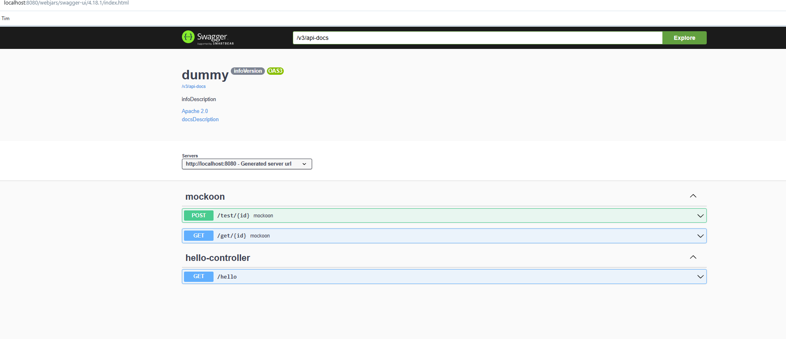

# Spring Cloud Gateway Facade with Spring-Cache and Swagger Integration

This project demonstrates how to integrate Swagger (OpenAPI) with Spring Cloud Gateway to document and test APIs across multiple microservices. 
Also uses spring cache to be able to use another caches like Redis, Memcached, etc. instead of Caffeine.

## Prerequisites

- Tested with JAVA 22
- Maven
- Spring Cloud

## Getting Started

### 1. Add Spring Cloud Gateway Dependencies

```xml
    <dependency>
        <groupId>org.springframework.cloud</groupId>
        <artifactId>spring-cloud-starter-gateway</artifactId>
    </dependency>
```

### 2. Add Swagger Dependencies

To enable Swagger, add the following dependencies to your `pom.xml` or `build.gradle`:

#### Maven:
```xml
    <dependency>
        <groupId>org.springdoc</groupId>
        <artifactId>springdoc-openapi-starter-webflux-ui</artifactId>
        <version>2.0.4</version>
    </dependency>
```
### 3. Add Cache Dependencies

```xml
    <dependency>
        <groupId>org.springframework.boot</groupId>
        <artifactId>spring-boot-starter-cache</artifactId>
    </dependency>
```
## Configuration
Add the following configuration to your `application.properties` or `application.yml` file:

```properties
gateway:
  services:
    mockoon:
      url: http://localhost:3000
      routes:
        - path: /get/{id}
          redirect: /test/{id}
          method: GET
          cached: true
        - path: /get/{id}
          redirect: /test/{id}
          method: POST
          cached: true
        - path: /get/{id}
          redirect: /get/{id}
          method: GET
          cached: false
```
---
## Test
### Swagger
    Goto `localhost:3000/swagger-ui.html`


### Gateway
    `curl --location 'localhost:80/test/1'`

